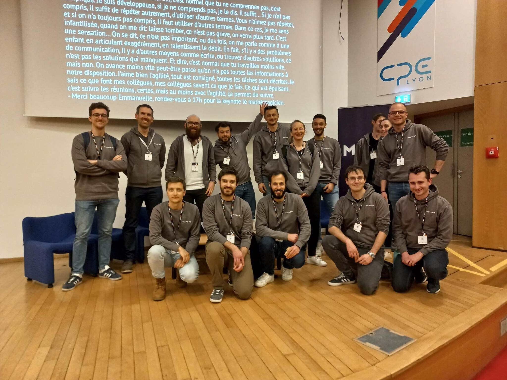
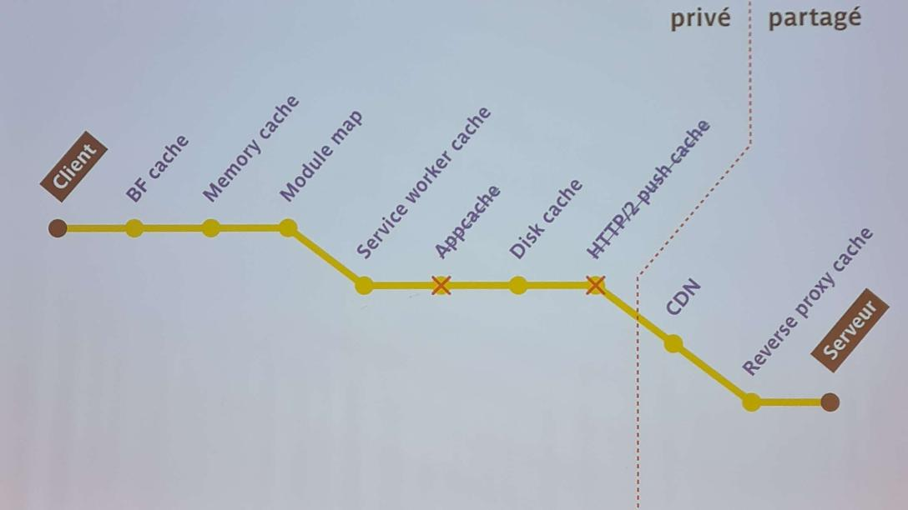
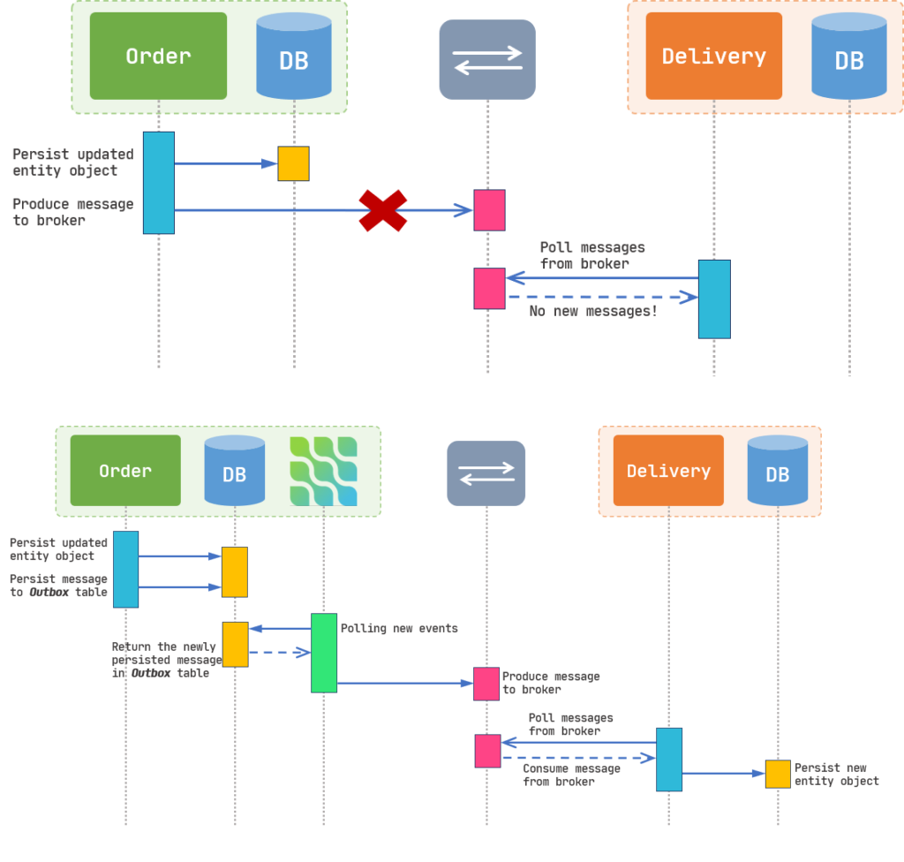
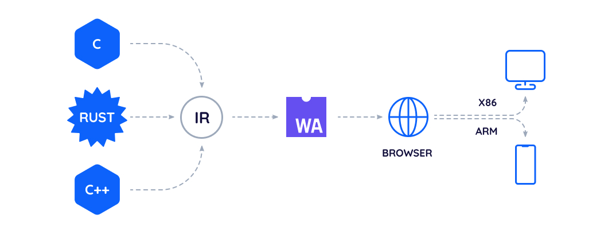

# Restitution MiXiT 2023 🥞

---

---
# Choisir la bonne technologie mobile pour votre projet

- Comparatif et évolution des 5 plus gros frameworks mobile de ces dernières années
- Natif ou cross-plateform ?

---
# How to clone Shazam

- Explique le fonctionnement de Shazam
- Traitement du signal (transformée de Fourrier)
  - notes, harmoniques, fréquences, signaux..
- PoC en JavaScript
- Démo live

---
# Le cache HTTP

## A quoi ça sert ?
- Réduire le temps de chargement côté client
- Réduire la charge côté serveur

### Meilleures performances = meilleur business

---
# Le cache HTTP

## Concerne tous le monde
- Front-end & backend
- Dev et Ops

## Casse tête

- Énormement d'options
- Pas mal de piège
  - `Cache-Control=no-cache` : permet l'utilisation du cache..

---

---
# Développement durable pour les logiciels

>  Le développement durable, c'est s'efforcer de répondre aux besoins du présent sans compromettre la capacité des générations futures de satisfaire les leurs.

### Reprendre la réalisation d'un projet en suivant les 3P : "People, profit, planet"

## Pas de formule magique
- Moins consommer
- Se concentrer sur ce dont on a besoin

## La réalisation en 5 grandes étapes 

---
# Développement durable pour les logiciels

## 1. Réfléchir à l'UX
- Définir l'utilisateur cible, les fonctionnalité attendues..
- Choisir, c'est optimiser (technos, principes ergonomiques mis en place..)

## 2. Architecture technique
  - N'utiliser que le nécessaire (stop les surcouches de frameworks inutiles)
  - Préferer une architecture modulaire
---
# Développement durable pour les logiciels
## 3. Choix de l'UI
  - Transmettre le bon message
  - Penser à l'accessibilité
  - Avoir des détails sans trop en faire, rester sobre
## 4. Phase de Développement
  - Tester en continu
  - Utiliser les bon éléments au bon endroit (ex: les bonnes balises pour l'HTML)
  - Code lisible et réutilisable
---
# Développement durable pour les logiciels
## 5. Passage en Production
- Ne pas surcharger le server physique : n'installer que le minimum requis
- Eteindre les serveurs inutiles ou avec des app obsolètes
- Préferer les hébergeurs eco-responsable
- Eviter d'utiliser des cookies (utilisés dans chaque requête..)

---
# Systèmes distribués

## Saga pattern

---
<!-- _class: imgList -->
# Systèmes distribués

## Outbox pattern
- Garantir l'intégrité des transactions dans les architectures basées sur des évènements :
- Stockage des évènement dans une table en base de données
- Un processus asynchrone récupère les évènements non-publiés et s'occupe de les publier dans le broker

---
# Systèmes distribués

- Timeout courts
  - Pourquoi faire attendre le client trop longtemps si un service est potentiellement tombé ?

- Exponential backoff
  - Attendre de plus en plus longtemps entre des requêtes tombant en échec

- Circuit breaker pattern

---
# WebAssembly

---

## Promesses

- Compilation de différents langages vers un même binaire `wasm`
- Runtimes WebAssembly :
  - Navigateur
  - Node.js
- Vitesse d'exécution améliorée
- Portabilité
- Sécurité (éxecution dans un contexte sandbox)

---
# WebAssembly
## Etat actuel
- V 2.0 (2019)
- Langages supportés (Browser) :
  - C/C++
  - Rust
  - Java
  - Python ⏳
- Langages spécifiques :
  - Grain
  - AssemblyScript (TypeScript-like)

---
# WebAssembly

## Etat actuel

- Docker + WASM (beta)

- WebAssembly System Interface (WASI) :
  - System interface to run WebAssembly outside the web
- Component model
